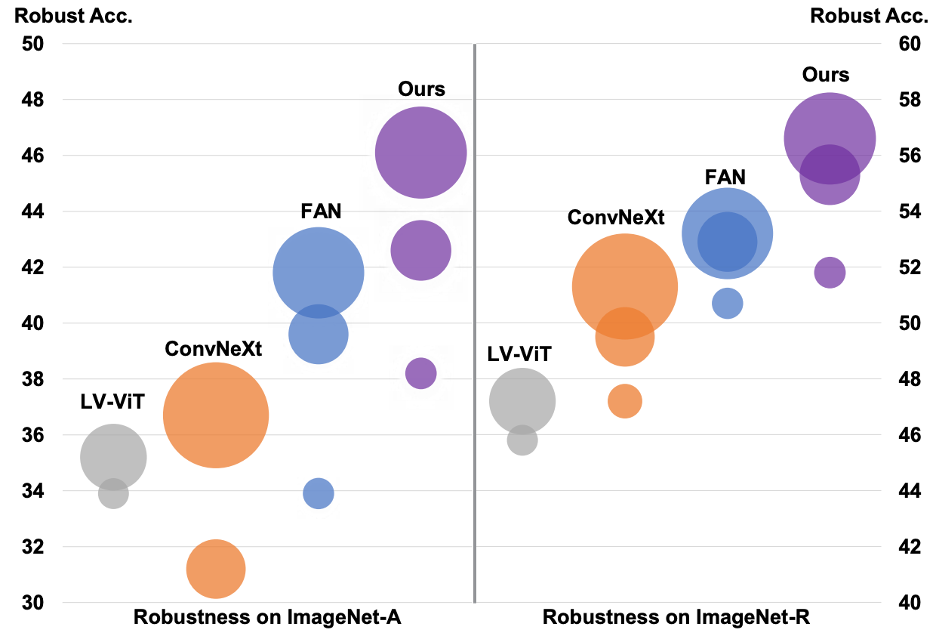
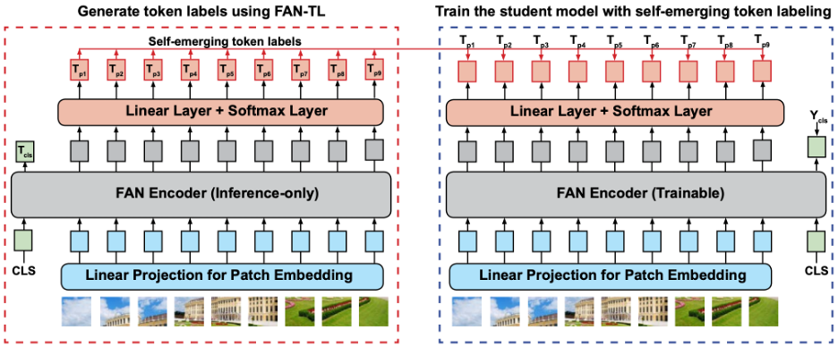

# Self-emerging Token Labeling (STL)
<!---
[](https://paperswithcode.com/sota/domain-generalization-on-imagenet-c?p=fully-attentional-networks-with-self-emerging) \
[](https://paperswithcode.com/sota/domain-generalization-on-imagenet-r?p=fully-attentional-networks-with-self-emerging) \
[](https://paperswithcode.com/sota/domain-generalization-on-imagenet-a?p=fully-attentional-networks-with-self-emerging) \
[](https://paperswithcode.com/sota/semantic-segmentation-on-cityscapes-val?p=fully-attentional-networks-with-self-emerging)
--->
	

### [Paper](https://arxiv.org/pdf/2401.03844.pdf) | [Poster](https://drive.google.com/file/d/1W_Kaon4Mr3Oc9pPt3EzMQSEY3I0ORmhi/view?usp=sharing) | [Slides](https://docs.google.com/presentation/d/1Ve5KZ0bF1D5Y9-9motV55k4PJyFTN1yXdhZCrG738MM/edit?usp=sharing)


**Fully Attentional Networks with Self-emerging Token Labeling** <br>
[Bingyin Zhao](https://bxz9200.github.io/), [Zhiding Yu](https://chrisding.github.io/), [Shiyi Lan](https://voidrank.github.io/), [Yutao Cheng](https://github.com/Tao-Cute), [Anima Anandkumar](https://research.nvidia.com/person/anima-anandkumar), [Yingjie Lao](https://ylao.people.clemson.edu/) and [Jose M. Alvarez](https://alvarezlopezjosem.github.io/). \
International Conference on Computer Vision, 2023.


<p align="center">

</p>


<p align="center">

</p>


## Contents
- [Install](#install)
- [Dataset](#dataset)
- [Models](#pre-trained-models)
- [Training](#training)
- [Evaluation](#evaluation)
- [FAN](#fully-attentional-networks)

## Install

1. Clone this repository and navigate to STL folder
```bash
git clone https://github.com/NVlabs/STL
cd STL
```

2. Install Package
```Shell
conda create -n STL python=3.10 -y
conda activate STL
pip install --upgrade pip
pip install -r requirements.txt
```

## Dataset
Download [ImageNet](http://image-net.org/) clean dataset and [ImageNet-C](https://zenodo.org/record/2235448) dataset and structure the datasets as follows:

```
/path/to/imagenet-C/
  clean/
    class1/
      img3.jpeg
    class2/
      img4.jpeg
  corruption1/
    severity1/
      class1/
        img3.jpeg
      class2/
        img4.jpeg
    severity2/
      class1/
        img3.jpeg
      class2/
        img4.jpeg
```

For other out-of-distribution shift benchmarks, we use [ImageNet-A](https://github.com/hendrycks/natural-adv-examples) or [ImageNet-R](https://github.com/hendrycks/imagenet-r/) for evaluation.

## Pre-trained Models
### FAN token labelers

| Model | #Params | Download |
|:---:|:---:|:---:|
| FAN-T-Hybrid-Teacher| 8.0M | [model](https://drive.google.com/file/d/19H58ISQmp4UE-tJb0S4LRMrwngmYkLYn/view?usp=sharing) |
| FAN-S-Hybrid-Teacher | 26.5M  | [model](https://drive.google.com/file/d/1RhAchy8GbEZjSMGBcj9i6Tkd0CDHRQoy/view?usp=sharing) |
| FAN-B-Hybrid-Teacher | 50.9M  | [model](https://drive.google.com/file/d/1-7mQK-UuV8rnB1MVhf7NJIdLAG9qHim3/view?usp=sharing) |
| FAN-L-Hybrid-Teacher | 77.3M | [model](https://drive.google.com/file/d/1w5NYL9c8uPmIjSeacLUDwpiWdEGdG5Lc/view?usp=sharing) |

### Student models trained with STL (Image resolution: 224x224)
| Model | Model Name | IN-1K | IN-C| IN-A| IN-R | #Params | Download |
|:---:|:---:|:---:|:---:|:---:|:---:|:---:|:---:|
| FAN-T-Hybrid-Student | fan_tiny_8_p4_hybrid_token | 79.9 | 58.2| 23.7 | 42.5 | 8.0M | [model](https://drive.google.com/file/d/1fiUzJs-9eq9CKay9OamTL4czwUtSeuMq/view?usp=sharing) |
| FAN-S-Hybrid-Student | fan_small_12_p4_hybrid_token | 83.4 | 65.5| 38.2 | 51.8 | 26.5M  | [model](https://drive.google.com/file/d/1RnN7wF0j-fZtdDLXszEWAVwETCyNhBNM/view?usp=sharing) |
| FAN-B-Hybrid-Student | fan_base_16_p4_hybrid_token | 84.5 | 68.2| 42.6 | 55.3 | 50.9M  | [model](https://drive.google.com/file/d/1d7Yi48eEL7X68CfQ62dG69PRHe5LEnWG/view?usp=sharing) |
| FAN-L-Hybrid-Student | fan_large_16_p4_hybrid_token | 84.7 | 68.8| 46.1 | 56.6 | 77.3M | [model](https://drive.google.com/file/d/1JXM7WxlOwciaK3dalPD4UDqbph-8wUlo/view?usp=sharing) |


<!---
FAN-T training on ImageNet-1K with 4 8-GPU nodes:
```
python3 -m torch.distributed.launch --nproc_per_node=8 --nnodes=$rank_num \
	--node_rank=$rank_index --master_addr="ip.addr" --master_port=$MASTER_PORT \
	 main.py  /PATH/TO/IMAGENET/ --model fan_tiny_8_p4_hybrid -b 32 --sched cosine --epochs 300 \
	--opt adamw -j 16 --warmup-epochs 5  \
	--lr 10e-4 --drop-path .1 --img-size 224 \
	--output ../fan_tiny_8_p4_hybrid/ \
	--amp --model-ema \
```
-->

## Training
STL has two phases. In the first phase, we train a FAN token labeler to produce semantically meaningful token labels. In the second phase, we train a student model by jointly using self-emerging token labels generated by FAN token labelers and original image-level labels. We provide pre-trained token labelers in [Pre-trained Models](#pre-trained-models). To save time, you can skip the first phase and train student models directly using the pre-trained token labelers.

### Train FAN token labelers
Train FAN token labelers with a single GPU node:

```
python3 -m torch.distributed.launch --nproc_per_node=8 \
train_token_labeler.py /PATH/TO/IMAGENET/ --model fan_small_12_p4_hybrid_token -b 128 --sched cosine --epochs 350 \
--opt adamw -j 16 --warmup-lr 1e-6 --warmup-epochs 5 \
--model-ema-decay 0.99992 --aa rand-m9-mstd0.5-inc1 --remode pixel \
--reprob 0.3 --lr 20e-4 --min-lr 1e-6 --weight-decay .05 --drop 0.0 \
--drop-path .25 --img-size 224 --mixup 0.8 --cutmix 1.0 \
--smoothing 0.1 \
--output /PATH/TO/SAVE/CKPT/ \
--amp --model-ema \
--token-label --cls-with-single-token-label \
```

Train FAN token labelers with multiple GPU nodes:
```
CUDA_VISIBLE_DEVICES=0,1,2,3,4,5,6,7 python3 -m torch.distributed.launch --nproc_per_node=8 --nnodes=$rank_num \
	--node_rank=$rank_index --master_addr="$ip_address" --master_port=3349 \
	train_token_labeler.py  /PATH/TO/IMAGENET/ --model fan_base_16_p4_hybrid_token -b 64 --sched cosine --epochs 350 \
	--opt adamw -j 16 --warmup-lr 1e-6 --warmup-epochs 10  \
	--model-ema-decay 0.99992 --aa rand-m9-mstd0.5-inc1 --remode pixel \
	--reprob 0.3 --lr 40e-4 --min-lr 1e-6 --weight-decay .05 --drop 0.0 \
	--drop-path .35 --img-size 224 --mixup 0.8 --cutmix 1.0 \
	--smoothing 0.1 \
	--output /PATH/TO/SAVE/CKPT/ \
	--amp --model-ema \
	--token-label --cls-with-single-token-label \
```

Or you can run the scripts directly:
```
cd scripts/fan_token_labeler/
bash fan_small_tl.sh
```


More details and scripts can be found in the folder [scripts/fan_token_labeler/](https://github.com/bxz9200/STL/tree/main/scripts/fan_token_labeler).

### Train student models with STL
Train student models with STL using a single GPU node:

```
python3 -m torch.distributed.launch --nproc_per_node=8 \
main.py  /PATH/TO/IMAGENET/ --model fan_small_12_p4_hybrid_token -b 128 --sched cosine --epochs 350 \
--opt adamw -j 16 --warmup-lr 1e-6 --warmup-epochs 5  \
--model-ema-decay 0.99992 --aa rand-m9-mstd0.5-inc1 --remode pixel \
--reprob 0.3 --lr 20e-4 --min-lr 1e-6 --weight-decay .05 --drop 0.0 \
--drop-path .25 --img-size 224 --mixup 0.8 --cutmix 1.0 \
--smoothing 0.1 \
--output  /PATH/TO/SAVE/CKPT/ \
--amp --model-ema \
--token-label --cls-weight 1.0 --dense-weight 1.0 \
--offline-model  /PATH/TO/LOAD/CKPT/fan_token_labeler.pth.tar \
```

Train student models with STL using multiple GPU nodes:

```
CUDA_VISIBLE_DEVICES=0,1,2,3,4,5,6,7 python3 -m torch.distributed.launch --nproc_per_node=8 --nnodes=$rank_num \
	--node_rank=$rank_index --master_addr="$ip_address" --master_port=3349 \
	main.py  /PATH/TO/IMAGENET/ --model fan_base_16_p4_hybrid_token -b 64 --sched cosine --epochs 350 \
	--opt adamw -j 16 --warmup-lr 1e-6 --warmup-epochs 10  \
	--model-ema-decay 0.99992 --aa rand-m9-mstd0.5-inc1 --remode pixel \
	--reprob 0.3 --lr 40e-4 --min-lr 1e-6 --weight-decay .05 --drop 0.0 \
	--drop-path .35 --img-size 224 --mixup 0.8 --cutmix 1.0 \
	--smoothing 0.1 \
	--output /PATH/TO/SAVE/CKPT/ \
	--amp --model-ema \
	--token-label  --cls-weight 1.0 --dense-weight 1.0 \
	--offline-model /PATH/TO/LOAD/CKPT/fan_token_labeler.pth.tar \
```

Or you can run the scripts directly:
```
cd scripts/fan_stl_student/
bash fan_small_stl.sh
```

More details and scripts can be found in the folder [scripts/fan_stl_student/](https://github.com/bxz9200/STL/tree/main/scripts/fan_stl_student).

## Evaluation

### Evaluation on ImageNet-1K and ImageNet-C
```
bash scripts/imagenet_c_val.sh $model_name $ckpt
```

### Evaluation on ImageNet-A
```
bash scripts/imagenet_a_val.sh $model_name $ckpt
```

### Evaluation on ImageNet-R
```
bash scripts/imagenet_r_val.sh $model_name $ckpt
```

## Fully Attentional Networks
STL is built upon [Fully Attentional Networks](https://arxiv.org/abs/2204.12451) (FAN). FAN is a family of general-purpose Vision Transformer backbones that are highly robust to unseen natural corruptions in various visual recognition tasks. If you are interested in the original FAN design, please refer to [the official implementation of FAN](https://github.com/NVlabs/FAN).

## License

Copyright © 2023, NVIDIA Corporation. All rights reserved.

This work is made available under the Nvidia Source Code License-NC. Click [here](https://github.com/NVlabs/STL/blob/main/LICENSE) to view a copy of this license.

The pre-trained models are shared under CC-BY-NC-SA-4.0. If you remix, transform, or build upon the material, you must distribute your contributions under the same license as the original.

For business inquiries, please visit our website and submit the form: [NVIDIA Research Licensing](https://www.nvidia.com/en-us/research/inquiries/).

## Citation
If you find STL helpful for your research and applications, please cite using the BibTeX:
```
@inproceedings{zhao2023fully,
  title={Fully Attentional Networks with Self-emerging Token Labeling},
  author={Zhao, Bingyin and Yu, Zhiding and Lan, Shiyi and Cheng, Yutao and Anandkumar, Anima and Lao, Yingjie and Alvarez, Jose M},
  booktitle={IEEE/CVF International Conference on Computer Vision (ICCV)},
  year={2023}
}
```

## Acknowledgement
This repository is built using the [timm](https://github.com/rwightman/pytorch-image-models) library, [FAN](https://github.com/NVlabs/FAN), [DeiT](https://github.com/facebookresearch/deit), [PVT](https://github.com/whai362/PVT) and [SegFormer](https://github.com/NVlabs/SegFormer) repositories.
